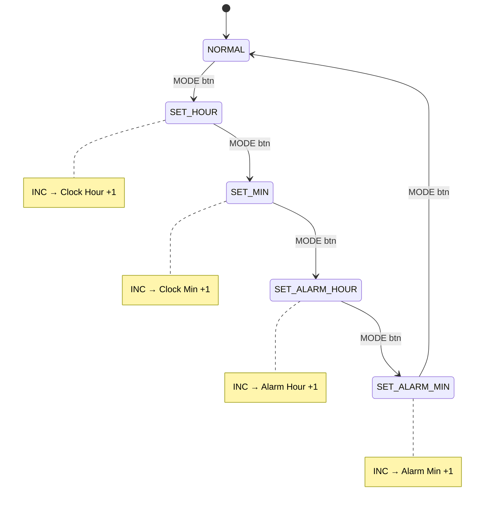

# ⏰ FPGA Digital Clock — Basys 3

A fully functional **12-hour digital clock with alarm** implemented in Verilog on the **Digilent Basys 3** FPGA development board (Xilinx Artix-7, XC7A35T). The time is displayed on the onboard **4-digit seven-segment display** and the user can set the clock and alarm through physical push buttons and a switch.

---

## 📑 Table of Contents

- [Features](#-features)
- [Architecture Overview](#-architecture-overview)
- [Module Descriptions](#-module-descriptions)
  - [digital\_clock\_top](#1-digital_clock_topv--top-module)
  - [clock\_div](#2-clock_divv--clock-divider)
  - [time\_Counter](#3-time_counterv--time-counter)
  - [Debounce](#4-debouncev--button-debouncer)
  - [pulse Gen](#5-pulse-genv--edge-detector--pulse-generator)
  - [FSM Control](#6-fsm-controlv--finite-state-machine-controller)
  - [alarm](#7-alarmv--alarm-logic)
  - [seven\_seg](#8-seven_segv--seven-segment-display-driver)
- [FSM State Diagram](#-fsm-state-diagram)
- [I/O Pin Mapping](#-io-pin-mapping)
- [How to Build & Program](#-how-to-build--program)
- [How to Use the Clock](#-how-to-use-the-clock)
- [Project File Structure](#-project-file-structure)
- [Tools & Requirements](#-tools--requirements)
- [License](#-license)

---

## ✨ Features

| Feature | Details |
|---|---|
| **12-Hour Format** | Displays time in `HH:MM` format with AM/PM tracking |
| **Time Setting** | Set hours and minutes independently via push buttons |
| **Alarm** | Configurable alarm with hour & minute settings |
| **Alarm LED** | An onboard LED turns ON when the alarm triggers |
| **Alarm Enable/Disable** | A slide switch enables or disables the alarm |
| **Alarm Clear** | A dedicated button silences an active alarm |
| **Button Debouncing** | Hardware debounce logic (~1 ms) prevents false triggers |
| **Edge Detection** | Single-pulse generation ensures one action per button press |
| **Multiplexed Display** | 4-digit seven-segment display driven via time-multiplexing |

---

## 🏗 Architecture Overview

The design follows a **modular, hierarchical** approach. Every logical function (timekeeping, display, input handling, alarm, control) is encapsulated in its own Verilog module and wired together in the top-level module.

```
                          ┌───────────────────────────────────────────────────┐
                          │          digital_clock_top                        │
                          │                                                   │
  100 MHz clk ───────────►│  ┌────────────┐    ┌──────────────┐               │
                          │  │ clock_div  │───►│ time_Counter │               |
  rst ───────────────────►│  │ (1 Hz tick)│    │ (HH:MM:SS)   │               │
                          │  └────────────┘    └──────┬───────┘               │
                          │                           │                       │
  btn_mode ──►[Debounce]──►[pulse_gen]──┐             │                       │
  btn_inc  ──►[Debounce]──►[pulse_gen]──┤             ▼                       │
  btn_alarm  ──►[Debounce]►[pulse_gen]──┤   ┌──────────────┐                  │
              clear         │           │   │    alarm     │──► alarm_led     │
                          │ └──────┬────┘   │ (match logic)│                  │
  sw_alarm   ─────────────┤        │        └──────────────┘                  │
    enable                │        ▼                                          │
                          │  ┌──────────────┐   ┌─────────────┐               │
                          │  │ fsm_Control  │   │  seven_seg  │──► seg[6:0]   │
                          │  │ (5-state FSM)│   │ (mux driver)│──► an[3:0]    │
                          │  └──────────────┘   └─────────────┘               │
                          └───────────────────────────────────────────────────┘
```

### Data Flow Summary

1. **`clock_div`** divides the 100 MHz board clock down to a **1 Hz tick** (`sec_tick`).
2. **`time_Counter`** uses `sec_tick` to count seconds → minutes → hours in 12-hour format with AM/PM toggle.
3. Three **`Debounce` + `pulse_gen`** pairs clean and edge-detect the three push-button inputs.
4. **`fsm_Control`** cycles through five states (Normal → Set Hour → Set Min → Set Alarm Hour → Set Alarm Min) via the **MODE** button, and routes the **INC** button to the appropriate counter.
5. **`alarm`** compares the current time against the user-set alarm time; if they match and the alarm is enabled, it asserts `alarm_on`.
6. **`seven_seg`** multiplexes the hour and minute digits across the 4-digit display at ~1 kHz.

---

## 📦 Module Descriptions

### 1. `digital_clock_top.v` — Top Module

The top-level wrapper that instantiates and interconnects all sub-modules.

| Port | Direction | Width | Description |
|---|---|---|---|
| `clk` | Input | 1 | 100 MHz system clock |
| `rst` | Input | 1 | Active-high reset |
| `btn_mode` | Input | 1 | Push button — cycle through FSM modes |
| `btn_inc` | Input | 1 | Push button — increment the selected field |
| `btn_alarm_clear` | Input | 1 | Push button — silence the alarm |
| `sw_alarm_enable` | Input | 1 | Slide switch — enable/disable alarm |
| `seg[6:0]` | Output | 7 | Seven-segment cathode signals (active-low) |
| `an[3:0]` | Output | 4 | Seven-segment anode enables (active-low) |
| `alarm_led` | Output | 1 | LED — HIGH when alarm is active |

---

### 2. `clock_div.v` — Clock Divider

Generates a **single-cycle pulse every 1 second** from the 100 MHz input clock.

| Parameter | Value | Purpose |
|---|---|---|
| `MAX_CNT` | 100,000,000 | Number of clock cycles in 1 second at 100 MHz |

**How it works:** A 27-bit counter increments every clock cycle. When it reaches `MAX_CNT - 1`, it resets to zero and asserts `sec_tick` for exactly one clock cycle.

---

### 3. `time_Counter.v` — Time Counter

Maintains the current time in **12-hour format** (1–12) with an AM/PM flag.

| Signal | Width | Reset Value | Description |
|---|---|---|---|
| `sec` | 6 bits | 0 | Seconds (0–59) |
| `min` | 6 bits | 0 | Minutes (0–59) |
| `hour` | 4 bits | 12 | Hours (1–12) |
| `am_pm` | 1 bit | 0 (AM) | 0 = AM, 1 = PM |

**Counting logic (on every `sec_tick`):**

```
sec → 0–59, then rolls over to 0
  └─► min → 0–59, then rolls over to 0
        └─► hour → 12 → 1 → 2 → … → 11 → 12 (AM/PM toggles at 11→12)
```

---

### 4. `Debounce.v` — Button Debouncer

Eliminates mechanical **contact bounce** on push-button inputs.

**Mechanism:**
- Synchronizes the raw button signal (`noisy_btn`) into `btn_sync`.
- If `btn_sync` differs from the current `clean_btn`, a 17-bit counter starts incrementing.
- After **100,000 cycles (~1 ms at 100 MHz)** of sustained difference, the output latches to the new stable value.

---

### 5. `pulse Gen.v` — Edge Detector / Pulse Generator

Converts a **level signal** (from the debouncer) into a **single-clock-cycle pulse** on the rising edge.

```
level:     ___/‾‾‾‾‾‾‾‾\___
pulse:     ___/‾\___________
```

This ensures that holding a button down produces only **one** increment, not a continuous stream.

---

### 6. `FSM Control.v` — Finite State Machine Controller

A **5-state Moore FSM** that determines the clock's operating mode.

| State | Encoding | Description |
|---|---|---|
| `NORMAL` | 3'd0 | Clock runs normally; INC button has no effect |
| `SET_HOUR` | 3'd1 | INC button increments the **clock hour** |
| `SET_MIN` | 3'd2 | INC button increments the **clock minute** |
| `SET_ALARM_HOUR` | 3'd3 | INC button increments the **alarm hour** |
| `SET_ALARM_MIN` | 3'd4 | INC button increments the **alarm minute** |

The **MODE** button cycles through the states sequentially:  
`NORMAL → SET_HOUR → SET_MIN → SET_ALARM_HOUR → SET_ALARM_MIN → NORMAL → …`

The **INC** button is routed to the corresponding counter via combinational gating:

```verilog
assign inc_hour       = (state == SET_HOUR)       && inc_btn;
assign inc_min        = (state == SET_MIN)        && inc_btn;
assign inc_alarm_hour = (state == SET_ALARM_HOUR) && inc_btn;
assign inc_alarm_min  = (state == SET_ALARM_MIN)  && inc_btn;
```

---

### 7. `alarm.v` — Alarm Logic

Provides a **settable alarm** with match-and-trigger functionality.

| Feature | Detail |
|---|---|
| **Default alarm time** | 6:00 AM |
| **Setting** | Hour and minute adjustable via FSM + INC button |
| **Match condition** | `curr_hour == alarm_hour && curr_min == alarm_min && curr_sec == 0 && curr_am_pm == alarm_am_pm` |
| **Enable** | Controlled by `sw_alarm_enable` (slide switch) |
| **Clear** | `alarm_clear` button silences the alarm (sets `alarm_on = 0`) |
| **Output** | `alarm_on` drives the onboard LED (active-high) |

The alarm fires **once** when all time fields match and the alarm is enabled. It stays on until the user presses the clear button.

---

### 8. `seven_seg.v` — Seven-Segment Display Driver

Drives the Basys 3's **4-digit, common-anode seven-segment display** using time-division multiplexing.

**Multiplexing:**
- A 17-bit counter divides the 100 MHz clock to cycle through the 4 digits at roughly **1 kHz** (100,000 cycles per digit).
- Only one digit is active at a time; persistence of vision makes all four appear lit simultaneously.

**Digit mapping (active-low cathodes):**

| Digit Position | Anode | Content |
|---|---|---|
| `an[3]` (leftmost) | `4'b0111` | Hour tens digit |
| `an[2]` | `4'b1011` | Hour ones digit |
| `an[1]` | `4'b1101` | Minute tens digit |
| `an[0]` (rightmost) | `4'b1110` | Minute ones digit |

**Segment encoding (active-low, `a` through `g`):**

| Digit | `seg[6:0]` |
|---|---|
| 0 | `1000000` |
| 1 | `1111001` |
| 2 | `0100100` |
| 3 | `0110000` |
| 4 | `0011001` |
| 5 | `0010010` |
| 6 | `0000010` |
| 7 | `1111000` |
| 8 | `0000000` |
| 9 | `0010000` |

---

## 🔄 FSM State Diagram



---

## 🔌 I/O Pin Mapping

> **Note:** The exact constraint file (`.xdc`) pin assignments depend on your Vivado project configuration. Below is the typical Basys 3 mapping used with this design.

| Signal | Basys 3 Resource | Typical Pin |
|---|---|---|
| `clk` | 100 MHz oscillator | W5 |
| `rst` | Push button (Center) | U18 |
| `btn_mode` | Push button (Left) | W19 |
| `btn_inc` | Push button (Right) | T17 |
| `btn_alarm_clear` | Push button (Down) | U17 |
| `sw_alarm_enable` | Slide switch SW0 | V17 |
| `seg[6:0]` | Seven-segment cathodes | W7, W6, U8, V8, U5, V5, U7 |
| `an[3:0]` | Seven-segment anodes | U2, U4, V4, W4 |
| `alarm_led` | LED LD0 | U16 |

---

## 🛠 How to Build & Program

### Prerequisites

- **Xilinx Vivado** (2020.2 or later recommended)
- **Digilent Basys 3** FPGA board
- USB cable (Micro-USB) for programming

### Steps

1. **Clone the repository**
   ```bash
   git clone https://github.com/<your-username>/FPGA-Digital-Clock.git
   cd FPGA-Digital-Clock
   ```

2. **Create a new Vivado project**
   - Open Vivado → *Create Project* → select **RTL Project**
   - Target part: `xc7a35tcpg236-1` (Basys 3)

3. **Add source files**
   - Add all `.v` files from this repository as design sources.

4. **Add constraints**
   - Create or import a `.xdc` constraints file with the pin mappings shown in the [I/O Pin Mapping](#-io-pin-mapping) section.

5. **Synthesize & Implement**
   - Run *Synthesis* → *Implementation* → *Generate Bitstream*.

6. **Program the FPGA**
   - Connect the Basys 3 via USB.
   - Open *Hardware Manager* → *Auto Connect* → *Program Device*.
   - Select the generated `.bit` file and click **Program**.

---

## 🕹 How to Use the Clock

| Action | Control |
|---|---|
| **Reset** | Press the **Center** button — resets time to `12:00 AM`, alarm to `6:00 AM` |
| **Switch mode** | Press the **Mode** button (Left) to cycle: Normal → Set Hour → Set Min → Set Alarm Hour → Set Alarm Min → Normal |
| **Increment** | Press the **Inc** button (Right) to increase the currently selected field by 1 |
| **Enable alarm** | Flip **SW0** to the ON position |
| **Disable alarm** | Flip **SW0** to the OFF position |
| **Silence alarm** | Press the **Alarm Clear** button (Down) when the alarm LED is on |

---

## 📂 Project File Structure

```
FPGA-Digital-Clock/
│
├── digital_clock_top.v    # Top-level module — wires everything together
├── clock_div.v            # 100 MHz → 1 Hz clock divider
├── time Counter.v         # HH:MM:SS time counter (12-hour format)
├── Debounce.v             # Button debounce filter (~1 ms)
├── pulse Gen.v            # Rising-edge detector / single-pulse generator
├── FSM Control.v          # 5-state FSM for mode control
├── alarm.v                # Alarm set, match, and trigger logic
├── seven_seg.v            # 4-digit seven-segment mux display driver
├── Img/                   # Project images (screenshots, block diagrams, etc.)
└── README.md              # This file
```

---

## 🧰 Tools & Requirements

| Tool | Version | Purpose |
|---|---|---|
| Xilinx Vivado | 2020.2+ | Synthesis, implementation, bitstream generation |
| Digilent Basys 3 | — | Target FPGA board (Artix-7 XC7A35T) |
| Verilog | IEEE 1364-2005 | Hardware Description Language |

---

## 📄 License

This project is open-source and available for educational purposes. Feel free to use, modify, and distribute.

---

<p align="center">
  <b>Built with ❤️ on the Basys 3 FPGA</b>
</p>
